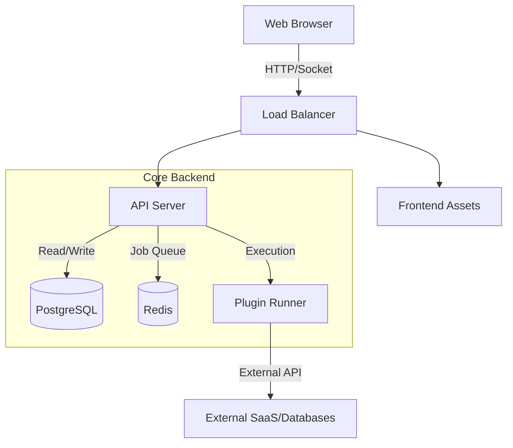

# Architecture & Technical Decisions

## 1. Context & Scope

### Requirements Overview

**Functional Requirements:**
- **App Builder:** Visual interface for dragging and dropping components to build UIs.
- **Data Connectivity:** Ability to connect to databases (Postgres, Mongo, etc.), APIs, and SaaS tools.
- **User Management:** Robust system for managing users, organizations, and permissions.
- **Extensibility:** Plugin system to add new data sources and UI components.

**Non-Functional Requirements:**
- **Extensibility:** The architecture must support dynamic loading of plugins without restarting the core server.
- **Real-time:** Collaboration features in the builder require low-latency state synchronization.
- **Security:** Strict isolation for plugin execution and robust RBAC for data access.
- **Scalability:** The server should be horizontally scalable (stateless API design).

**Scale & Complexity:**
- **Primary domain:** Low-code Platform (Full Stack)
- **Complexity level:** Enterprise
- **Estimated architectural components:** 5+ Major Parts (Frontend, Server, CLI, Plugins, Marketplace)

### Technical Constraints & Dependencies
- **Monorepo Structure:** All parts live in a single repo, requiring unified build and CI/CD piping.
- **Tech Stack:** Fixed to React (Frontend) and NestJS (Backend).
- **Database:** PostgreSQL is the primary store; TypeORM is the mandated ORM.

### Cross-Cutting Concerns Identified
- **Multi-tenancy:** Data and execution isolation per organization.
- **Authentication:** Unified auth strategy across CLI, Frontend, and Server.
- **Plugin Contract:** Strict interfaces defining how plugins interact with the core.

## 2. Starter Template Evaluation (Existing Stack Validation)

### Primary Technology Domain
**Full-stack Monorepo Application** (React + NestJS)

### Starter Options Considered
Since this is an existing brownfield project, we are evaluating the **current codebase** as our starting point.

### Selected Approach: Continue with Existing Stack

**Rationale for Selection:**
The project uses a modern, well-structured stack (React 18 + NestJS 11). Migrating to a new starter (like T3 or a different boilerplate) would introduce unnecessary risk and rewrite variance without significant benefit.

**Architectural Decisions Provided by Current Stack:**

**Language & Runtime:**
- **Node.js**: v22.15.1 (Latest LTS)
- **Language**: TypeScript throughout (Frontend & Backend).

**Styling Solution:**
- **Frontend**: SCSS Modules + TailwindCSS (detected in devDependencies).
- **Libraries**: `shadcn` and `@radix-ui` presence indicates a modern UI architecture.

**Build Tooling:**
- **Frontend**: Webpack 5.
- **Backend**: Nest CLI (tsc/swc).

**Testing Framework:**
- **Unit/Integration**: Jest (configured for both Frontend and Backend).
- **E2E**: Cypress (implied by `cypress-real-events`).

**Code Organization:**
- **Monorepo**: Distinct `frontend`, `server`, `plugins` directories.
- **Backend**: Modular NestJS architecture (Modules, Services, Controllers).
- **Frontend**: Feature-based folder structure (`AppBuilder`, `Dashboard`).

**Development Experience:**
- **Linting**: ESLint + Prettier.
- **Hot Reloading**: Webpack Dev Server.

## 3. Core Architectural Decisions

### Decision Priority Analysis

**Critical Decisions (Block Implementation):**
- **Plugin Isolation Strategy:** Enforce `isolated-vm` for all backend plugin execution.
- **Migration Strategy:** Standardize on TypeORM CLI for reliable schema management.

**Important Decisions (Shape Architecture):**
- **Real-time Protocol:** Restrict Socket.io usage to synchronous collaboration features (Canvas/App Builder) to minimize connection overhead.
- **Caching Layer:** Formalize Redis usage for API response caching, not just Job Queues.

### Data Architecture

- **Database:** PostgreSQL (v13+) implies strict ACID compliance requirements.
- **ORM:** TypeORM with strict entity definition patterns.
- **Migrations:** Automated via TypeORM CLI; must be reversible.
- **Caching:** Redis used for:
    1.  Job Queues (BullMQ)
    2.  Session Store
    3.  Heavy Query Caching (Optional, future optimization)

### Authentication & Security

- **Strategy:** Unified JWT-based authentication via Passport strategies.
- **Plugin Security:**
    - **Sandbox:** `isolated-vm` environment.
    - **Context:** Plugins receive a stripped-down context object, no direct DB access.

### API & Communication Patterns

- **REST:** Primary protocol for generic CRUD (Users, Apps, Resources).
- **Socket.io:** Exclusive protocol for App Builder 'multiplayer' events and live preview updates.
- **Inter-Service:** Direct Module Import (Monolothic) rather than HTTP (Microservices) for performance, until scale dictates ensuring splitting.

### Frontend Architecture

- **State Management:** RxJS (Observables) for complex event streams in the App Builder.
- **Component Lib:** `_ui` folder serves as the single source of truth for design tokens.

### Infrastructure & Deployment

- **Containerization:** Docker multi-stage builds (Development/Production targets).
- **CI/CD:** GitHub Actions (implied) running ESLint, Jest, and Cypress.

### Decision Impact Analysis

**Implementation Sequence:**
1.  Formalize Plugin Contract interfaces (TypeScript).
2.  Standardize API Response formats (Interceptors).
3.  Lock down Migration scripts.

**Cross-Component Dependencies:**
- Changes to `server/src/entities` MUST trigger a migration check.
- Updates to `plugin` interfaces require a version bump in the Plugin Runner.

## 4. Implementation Patterns & Consistency Rules

### Pattern Categories Defined

**Critical Conflict Points Identified:**
4 major areas where AI agents could make different choices (Naming, Structure, Testing, Error Handling).

### Naming Patterns

**Database Naming Conventions:**
- **Tables:** `snake_case` Plural (e.g., `feature_toggles`, `organization_users`).
- **Columns:** `snake_case` (e.g., `created_at`, `user_id`).
- **Foreign Keys:** `noun_id` (e.g., `organization_id`).

**API Naming Conventions:**
- **Endpoints:** RESTful Plural nouns (e.g., `GET /api/v1/apps`, `POST /api/v1/apps/:id/publish`).
- **Query Params:** `camelCase` (e.g., `?page=1&searchString=test`).

**Code Naming Conventions:**
- **Files:** `kebab-case` throughout (e.g., `data-source.ts`, `app-builder.tsx`).
- **Classes/Components:** `PascalCase` (e.g., `DataSourceService`, `InspectorPanel`).
- **Variables/Functions:** `camelCase` (e.g., `fetchData`, `isValid`).

### Structure Patterns

**Project Organization:**
- **Backend:** Modules are domain-centric.
    ```text
    server/src/
      modules/
        application/ 
          application.controller.ts
          application.service.ts
          application.entity.ts
    ```
- **Frontend:** Features are self-contained.
    ```text
    frontend/src/
      Editor/
        Components/
        Store/
    ```

**File Structure Patterns:**
- **Tests:** Co-located `*.spec.ts` for unit tests. Separate `test/` root folder for E2E.
- **DTOs:** Explicit `*.dto.ts` files for input validation, co-located with controllers.

### Format Patterns

**API Response Formats:**
- **Success:** Direct JSON payload or `{ data: ... }` wrapper (Must enforce standardized Interceptor).
- **Error:** Standard NestJS Exception structure: `{ statusCode: 404, message: "Not Found" }`.

**Data Exchange Formats:**
- **JSON:** Dates as ISO 8601 Strings.
- **Nulls:** Explicit `null` for missing values, never `undefined` in JSON.

### Process Patterns

**Error Handling Patterns:**
- **Backend:** Throw specific `HttpException` classes. DO NOT catch errors just to log them; let the Global Filter handle logging.
- **Frontend:** usage of Error Boundaries for component crashing.

**Loading State Patterns:**
- **Frontend:** Explicit `isLoading` flags in Redux/State slices. Skeleton loaders mandated for major page sections.

### Enforcement Guidelines

**All AI Agents MUST:**
- **Read Local Context:** Before editing a file, read the sibling files to match style (indentation, imports).
- **Strict Types:** `noImplicitAny` is ON. Do not use `any` unless absolutely necessary (and commented).
- **No Magic Strings:** Use Constants or Enums for all string literals used more than once.

### Pattern Examples

**Good Examples:**
```typescript
// user.controller.ts
@Controller('users')
export class UserController {
  constructor(private readonly usersService: UsersService) {}
  
  @Get(':id')
  async findOne(@Param('id') id: string): Promise<UserDto> {
    return this.usersService.findOne(id);
  }
}
```

**Anti-Patterns:**
```typescript
// bad naming, direct implementation without service
app.get('/get_user', async (req, res) => {
   const user = await db.query('SELECT * FROM Users'); // Raw query
   res.send(user);
});
```

## 5. System Structure
### Monorepo Overview

This project is a Monorepo containing the following distinct applications/packages:

*   **Server (`/server`)**: Main API Gateway, Business Logic, and Job Runner.
*   **Frontend (`/frontend`)**: React Application containing the Dashboard and App Builder.
*   **Plugins (`/plugins`)**: Collection of integration packages (Databases, SaaS, APIs) used by the Server.
*   **CLI (`/cli`)**: Developer tools for managing ToolJet instances and plugins.
*   **Marketplace (`/marketplace`)**: Integration registry.

### Detailed System Component Diagram

```mermaid
graph TD
    subgraph Client ["Client Layer"]
        Browser[Web Browser]
    end

    subgraph Frontend ["Frontend (React)"]
        FE_Router[Router/AppLoader]
        FE_Dashboard[Dashboard]
        FE_Editor[App Builder / Editor]
        FE_UI[UI Library (_ui)]
        FE_Services[API Services]
        
        FE_Router --> FE_Dashboard
        FE_Router --> FE_Editor
        FE_Dashboard --> FE_UI
        FE_Editor --> FE_UI
        FE_Dashboard --> FE_Services
        FE_Editor --> FE_Services
    end

    subgraph Server ["Server (NestJS)"]
        API[API Gateway / Controllers]
        
        subgraph Modules ["Core Modules"]
            Mod_Auth[Authentication & SSO]
            Mod_Users[Users & Organizations]
            Mod_Apps[Apps & Versioning]
            Mod_DS[Data Sources & Queries]
            Mod_TJDB[ToolJet Database]
            Mod_Workflows[Workflows]
        end
        
        subgraph Infrastructure ["Infrastructure Services"]
            Serv_Plugins[Plugin Runner]
            Serv_Email[Email / SMTP]
        end
        
        API --> Mod_Auth
        API --> Mod_Users
        API --> Mod_Apps
        API --> Mod_DS
        API --> Mod_TJDB
        API --> Mod_Workflows
        
        Mod_DS --> Serv_Plugins
        Mod_Workflows --> Serv_Plugins
    end

    subgraph Data ["Data Persistence"]
        DB[(PostgreSQL)]
        Redis[(Redis)]
    end

    subgraph External ["External Integrations"]
        Ext_DB[External Databases]
        Ext_API[External APIs]
        Ext_SaaS[SaaS Integrations]
    end

    Browser --> |HTTP/WS| FE_Router
    FE_Services --> |REST/Socket.io| API
    
    API --> DB
    API --> Redis
    
    Serv_Plugins --> Ext_DB
    Serv_Plugins --> Ext_API
    Serv_Plugins --> Ext_SaaS
```

### Source Tree Breakdown

```text
/
├── frontend/
│   ├── src/
│   │   ├── Editor/       # App Builder Logic
│   │   ├── Dashboard/    # Management Interfaces
│   │   ├── _ui/          # Design System implementation
│   │   └── services/     # API Client definitions
├── server/
│   ├── src/
│   │   ├── modules/      # NestJS Modules (Domain Logic)
│   │   │   ├── app_builder_plugins/
│   │   │   ├── data_sources/
│   │   │   └── tooljet_db/
│   │   ├── entities/     # TypeORM Entity Definitions
│   │   └── interceptors/ # Response/Error formatting
├── plugins/
│   ├── packages/         # Individual Plugin Source Code
└── cli/
    └── src/              # CLI Command logic
```

### Component Dependencies



## 6. Architecture Validation Strategy
<!-- How we will verify the architecture -->

### Automated Verification
We will use the following tools to ensure architectural compliance:

*   **Linting:** `ESLint` with strict rules to enforce import patterns and naming conventions.
*   **Type Checking:** `tsc --noEmit` locally and in CI to ensure TypeORM entities and Plugin interfaces match.
*   **Dependency Checks:** `dependency-cruiser` (recommended addition) to enforce module boundaries (e.g., "Frontend cannot import Server code").

### Manual Verification Checklist
Before approving a Pull Request, the reviewer must check:

- [ ] Does the database change have a corresponding reversible migration?
- [ ] Do new plugins follow the `isolated-vm` pattern?
- [ ] Are new API endpoints documented in Swagger/OpenAPI?
- [ ] Are new UI components added to `_ui` or using existing tokens?

### Validation Scenarios
1.  **Plugin Isolation Test:** Create a malicious plugin that attempts to read environment variables (`process.env`). Verify it fails.
2.  **Migration Rollback Test:** Run a migration up -> down -> up. Verify data integrity.
3.  **Cross-Service Dependency:** Attempt to import `server/src/utils` from `frontend`. Build should fail.
