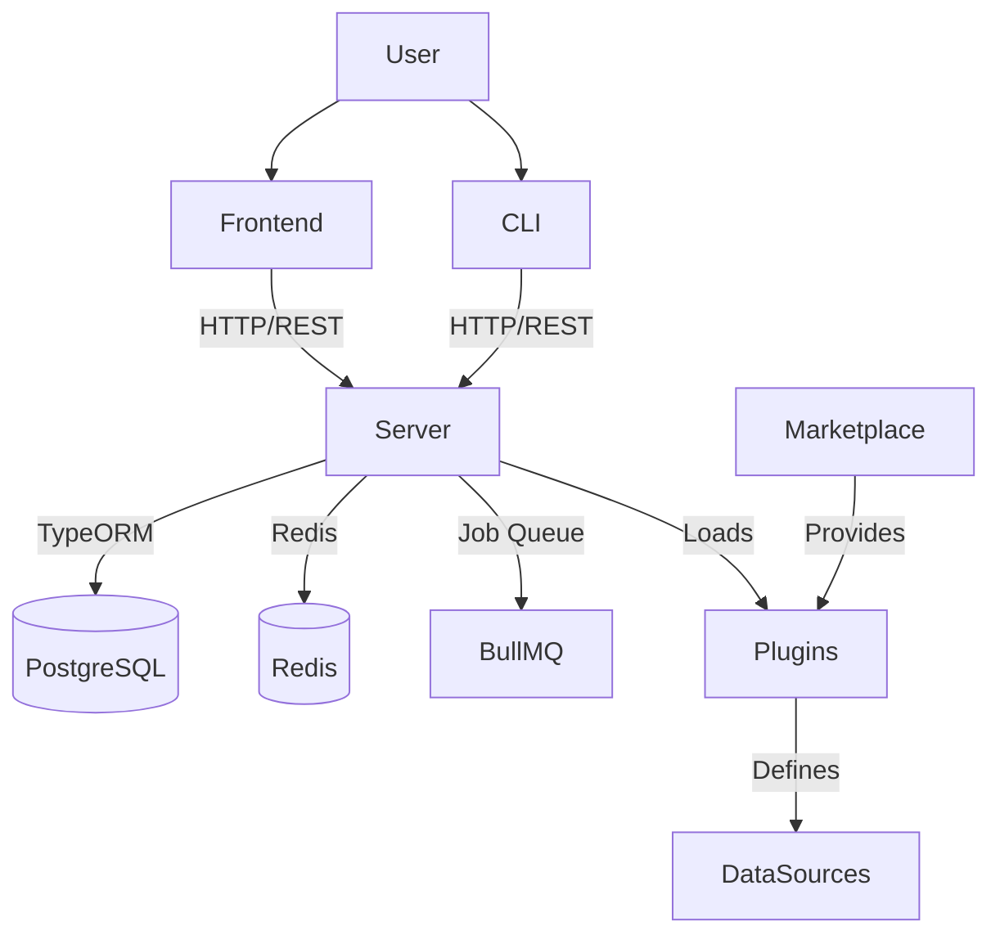

# Integration Architecture

## Overview
ToolJet is a modular system where distinct parts (Server, Frontend, CLI, Plugins) interact to provide a cohesive experience.

## System Diagram

## Integration Points

### 1. Frontend <-> Server
The Frontend is a React SPA that communicates with the NestJS Server via REST APIs.
- **Protocol**: HTTP/1.1 (JSON)
- **Auth**: JWT (transferred via Cookie/Header)
- **State Sync**: Frontend syncs local state (Zustand) with Server state via `AppVersionService` (auto-saves).

### 2. Server <-> Plugins
The Plugin system allows extending ToolJet with new Data Sources.
- **Mechanism**: Plugins are loaded dynamically.
- **Management**: `PluginsService` (`server/src/modules/plugins`) handles installation and lifecycle.
- **Storage**: Plugin metadata and files (manifest, operations, icon) are stored in the database (`plugins` table) and `files` table.
- **Marketplace**: The server reads `assets/marketplace/plugins.json` to discover available plugins.

### 3. Server <-> Database
- **ORM**: TypeORM is used for all database interactions.
- **Migrations**: Database schema changes are versioned and managed via TypeORM migrations.

### 4. CLI <-> Ecosystem
- **Plugin Management**: CLI commands (`plugin:create`, `plugin:install`) scaffold and manage plugins, likely interacting with the local file system or server APIs for installation.

## Data Flow: App Execution
1.  **Frontend** sends a query execution request (e.g., "Run PostgreSQL Query").
2.  **Server** receives the request.
3.  **Server** determines the Data Source type and delegates to the appropriate **Plugin/Service**.
4.  **Plugin** executes the query against the external database.
5.  **Result** is returned to Server -> Frontend.
